# Поток событий

## Use Case "Register"

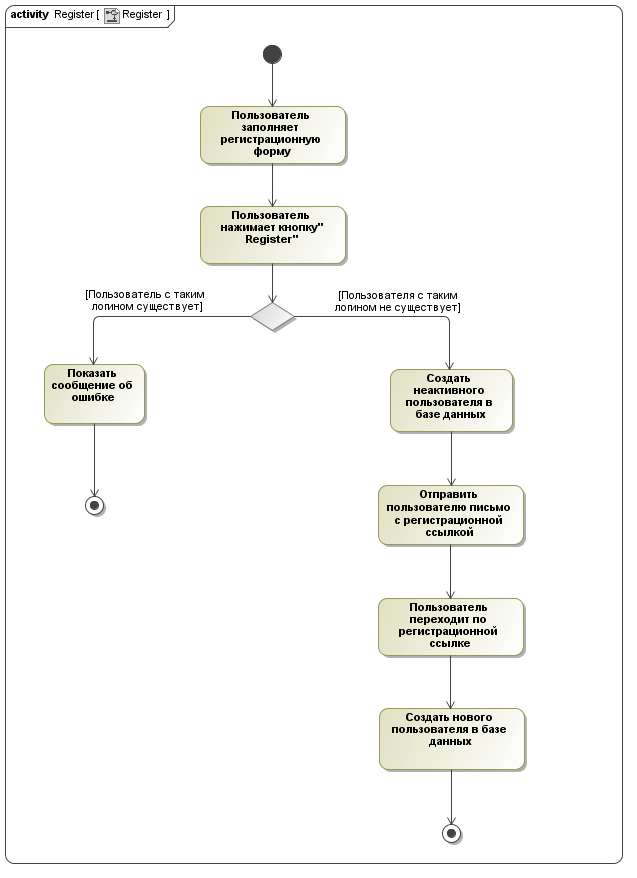

### Цель

Поток позволяет пользователю зарегестрироваться. 

### Предусловия

- Пользователь не должен быть авторизован ранее
- Пользователь должен находиться на страните входа

### Поток

Основной поток:

1. Пользователь заполняет форму регистрации
2. Пользователь нажимает кнопку "Register"
3. Если пользователь с указанными данными существует, выполняется альтернативный поток 1, иначе — альтернативный поток 2

Альтернативный поток 1:

1. Показать сообщение об ошибке
2. Поток завершается

Альтернативный поток 2:

1. В базе данных создается неактивный пользователь
2. Пользователю отправляется письмо с регистрационной ссылкой
3. Пользователь переходит по регистрационной ссылке
4. Пользователь активируется
5. Поток завершается

## Use case "Authenticate"

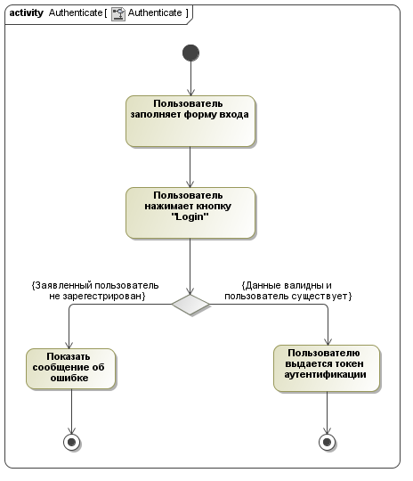

### Цель

Поток позволяет пользователю авторизоваться. 

### Предусловия

* Пользователь не должен быть авторизован ранее
* Пользователь должен находиться на страните входа

### Поток

Основной поток:

1. Пользователь заполняет форму входа
2. Пользователь нажимает кнопку "Login"
3. Если пользователь с указанными данными существует, выполняется альтернативный поток 1, иначе — альтернативный поток 2

Альтернативный поток 1:

1. Показать сообщение об ошибке
2. Поток завершается

Альтернативный поток 2:

1. Пользователю выдается токен аутентификации
2. Поток завершается

## Use Case "Logout"

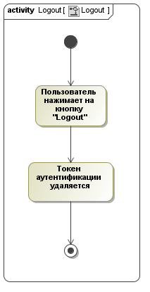

### Цель 

Use Case отражает возможность пользователя завершить работу с системой.

### Предусловия

* Пользователь должен быть аутентифицирован

### Поток

Основной поток:

1. Пользователь нажимает на кнопку "Logout"
2. Токен аутентификации пользователя удаляется

## Use Case "Leave Comment"

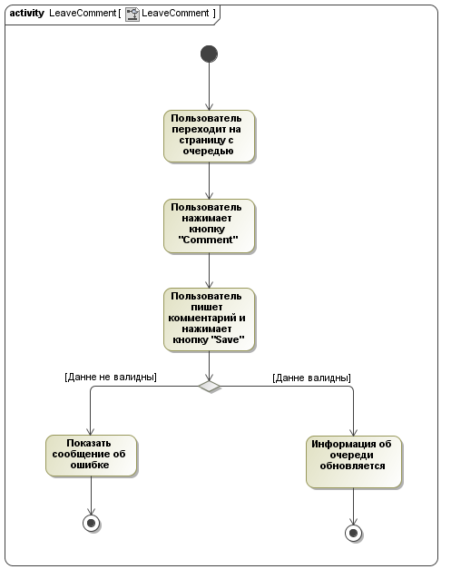

### Цель

Данный use case реализует возможность пользователя оставить комментарий. 

### Предусловия

- Пользователь должен быть аутетентифицирован либо администратором очереди должно быть дано разрешение на комментирование незарегестрированным пользователям

### Поток

Основной поток:

1. Пользователь переходит на страницу с информацией об очереди
2. Пользователь нажимает кнопку "Comment"
3. Пользователь набирает комментарий
4. Если комментарий не содежит невалидных данных, выполняется альтернативный поток 1, иначе — альтернативный поток 2

Альтернативный поток 1:

1. Показать сообщение об ошибке
2. Поток завершается

Альтернативный поток 2:

1. Информация об очереди обновляется — добавляется новый комментарий
2. Поток завершается

## Use Case "Update Profile"

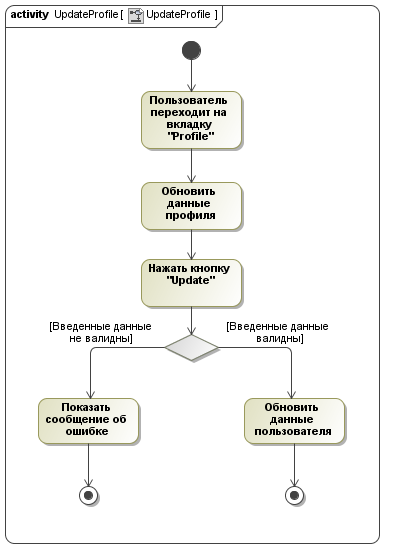

### Цель

Данный use case отражает возможность пользователя изменить свои контактные данные. 

### Предусловия

- Пользователь должен быть аутетентифицирован

### Поток

Основной поток:

1. Пользователь переходит на вкладку "Profile"
2. Пользователь обновляет контактные данные
3. Пользователь нажимает кнопку "Update"
4. Если введенные контактные данные не содежат невалидных данных, выполняется альтернативный поток 1, иначе — альтернативный поток 2

Альтернативный поток 1:

1. Показать сообщение об ошибке
2. Поток завершается

Альтернативный поток 2:

1. Информация о пользователе обновляется
2. Поток завершается

## Use Case "Delete Profile"

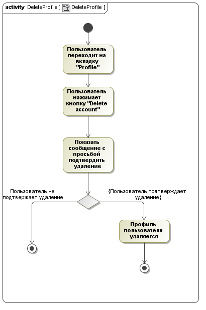

### Цель

Данный use case отражает возможность пользователя удалить свой профиль.

### Предусловия

* Пользователь должен быть аутентифицирован

### Поток

Основной поток:

1. Пользователь переходит на вкладку "Profile"
2. Пользователь нажимает кнопку "Delete account"
3. Показать сообщение с просьбой подтвердить удаление
4. Если пользоатель подтвердил удаление, выполняется альтернативный поток 1, иначе — альтернативный поток 2

Альтернативный поток 1:

1. Поток завершается

Альтернативный поток 2:

1. Профиль пользователя удаляется
2. Поток завершается

## Use Case "Create Queue"

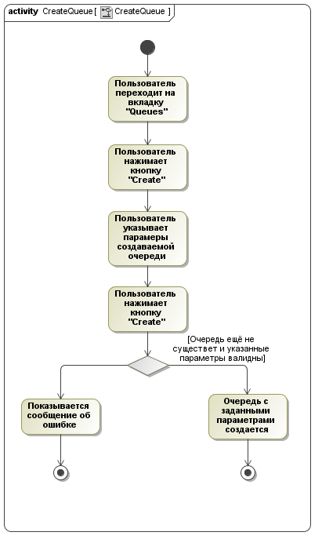

### Цель

Данный use case отражает возможность пользователя создать очередь.

### Предусловия

- Пользователь должен быть аутентифицирован

### Поток

Основной поток:

1. Пользователь переходит на вкладку "Queues"
2. Пользователь нажимает кнопку "Create"
3. Пользователь вводит параметры создаваемой очереди
4. Пользователь нажимает кнопку "Create"
5. Если очередь с таким именем ещё не существует и введенные пользователем данные валидны, выполняется альтернативный поток 1, иначе — альтернативный поток 2

Альтернативный поток 1:

1. Поток завершается

Альтернативный поток 2:

1. Создается новая очередь
2. Поток завершается

## Use Case "Change Queue State"

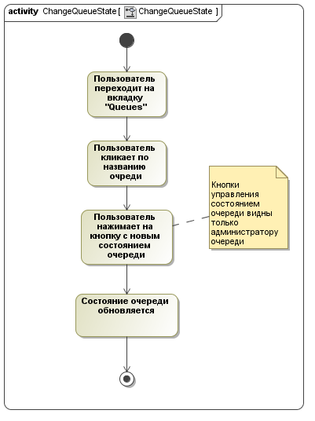

### Цель

Данный use case отражает возможность администратора очереди изменить её состояние. 

### Предусловия

- Пользователь должен быть аутентифицирован
- Пользователь должен быть администратором модифицируемой очереди

### Поток

Основной поток:

1. Пользователь переходит на вкладку "Queues"
2. Пользователь переходит на страницу с информацией об очереди
3. Пользователь нажимает кнопку с новым состоянием очереди
4. Состояние очереди обновляется

## Use Case "Enter Queue"

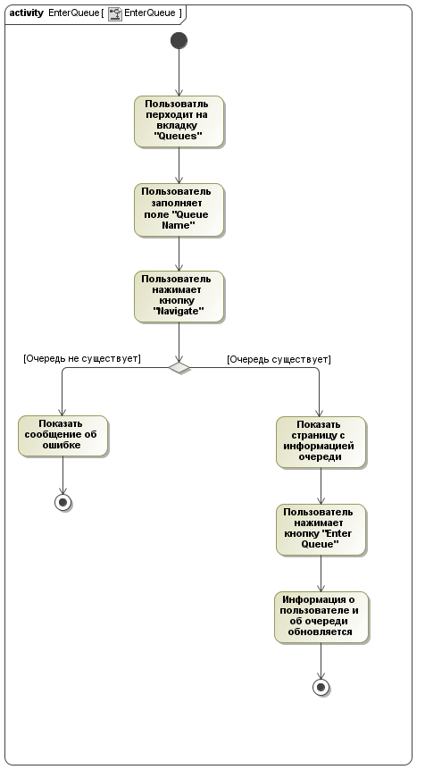

### Цель

Данный use case отражает возможность пользователя вступить в очередь

### Предусловия

- Пользователь должен быть аутентифицирован либо администратор очереди позволил неавторизованным пользователям вступать в неё

### Поток

Основной поток:

1. Пользователь переходит на вкладку "Queues"
2. Пользователь заполняет поле "Queue Name"
3. Пользователь пытается перейти на страницу с информацией об очереди
4. Если очередь с таким именем не существует, выполняется альтернативный поток 1, иначе — альтернативный поток 2

Альтернативный поток 1:

1. Показать сообщение об ошибке
2. Поток завершается

Альтернативный поток 2:

1. Пользователь попадает на страницу с информацией об очереди
2. Пользователь нажимает кнопку "Enter Queue"
3. Информация о пользователе и очереди обновляется
4. Поток завершается

## Use Case "Leave Queue"

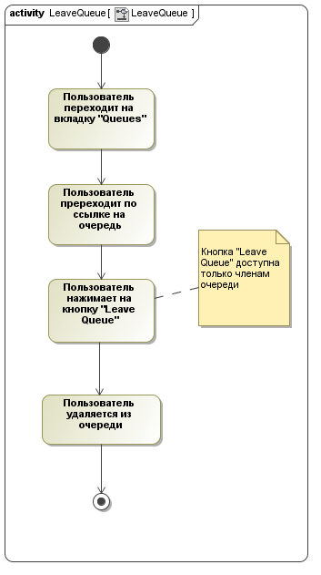

### Цель

Данный use case отражает возможность пользователя вступить в очередь

### Предусловия

- Пользователь должен быть аутентифицирован либо администратор очереди позволил неавторизованным пользователям вступать в неё
- Пользователь должен быть членом очереди

### Поток

Основной поток:

1. Пользователь переходит на вкладку "Queues"
2. Пользователь переходит по ссылке на очредь
3. Пользователь нажимает кнопку "Leave Queue"
4. Пользователь удаляется из очереди

## Use Case "Push Queue"

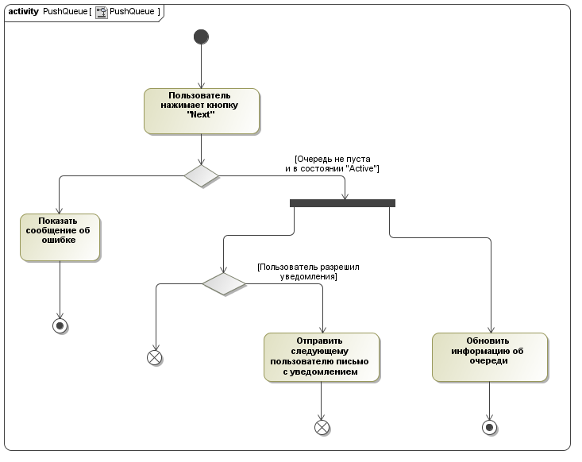

### Цель

Use case отражает возможность администратора очереди начать обработку следующего пользователя.

### Предусловия

* Пользователь должен быть аутентифицирован

* Пользователь должен быть администратором очереди
* Очередь должна быть в стостоянии "Active"
* Пользователь должен находится на странице с иформацией об очереди

### Поток

Основной поток:

1. Пользователь нажимает кнопку "Next"
2. Если очередь пуста либо находится не в состоянии "Active", выполняется альтернативный поток 1, иначе — альтернативный поток 2

Альтернативный поток 1:

1. Показать сообщение об ошибке
2. Поток завершается

Альтернативный поток 2:

1.  Если пользователь разрешил уведомления от приложения, выполняется альтернативный поток 3, иначе — альтернативный поток 4
2. Обновить информацию об очереди
3. Поток завершается

Альтернативный поток 3:

1. Альтернативный поток завершается

Альтернативный поток 4:

1. Следующему пользователю отправляется уведомление
2. Поток завершается