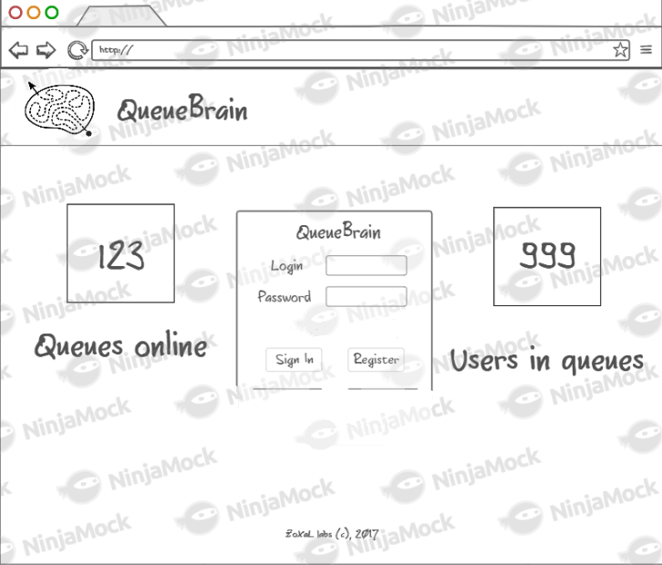

# Требования

## Требования пользователя

### Программные интерфейсы

- Должна быть предусмотрена авторизация с подтверждением по почте
- Должно быть реализовано REST API, позволяющее полноценно работать с приложением, в том числе от лица администратора. 

### Интерфейс пользователя

- Главный экран приложения
  
- Кабинет пользователя
  
- Страница с очередью
  

### Характеристики пользователей

QueueBrain хорошо подойдет для огранизации нерегулярных очередей с несложными процессами обработки. Интерфейс и идея программы достаточно просты и привычны для среднего Интернет-пользователя.

## Системные требования:

#### Действия пользователей

Зарегестрированные пользователи должны иметь возможность:

- Вставать в очереди
- Создавать очереди
- Проталкивать очереди (разрешено только администратору очереди

#### Управление очередями

- Доступ к управлению очередью должен иметь только администратор. 

- При создании очереди должны быть доступны следующие настройки:

  - Название очереди

- Администратор должен иметь возможность протолкнуть очредь (перейти к следующему пользователю)

- На иформационной странице очереди должна быть доступна информация:
  - QR-код ссылки на очередь
  - Последний обработанный пользователь и общее количество пользователей

## Нефункциональные требования

* Приложение должно быть разбито на две независимо работающие части — серверную и клиентскую. Серверная часть должна быть релизована на языке java с использованием фреймворка **Spring**; клиентская часть должна быть реализована на языке typescript/javascript с использованием фреймворка **Angular**. Взаимодействие клиентской части с серверной должно вестись только через публичный API. 
* Валидации на длину пароля быть не должно, потому что ввод длинных и сложных паролей разражает и утомляет пользователей. 
* Наличие валидации корректности почтового адреса. 
* Серверная часть приложения должна производить отслеживание и логирование ошибок. 
* Интерфейс пользователя должен быть выполнен в светлых (желательно белых) тонах, потому что сейчас зима.
* Серверная часть должна работать по защищенному протоколу (https)

## Аналоги

Основное отличие от большинства аналогов -- способ предоставления сервиса. QueueBrain является веб-приложением, это значительно упрощает процесс использования, а публичное API позволяет легко интегрировать его с другими системами. 
Все перечисленные аналоги требуют предварительной установки и настройки.

- https://led-displays.ru/programma_suo.html
  - Платная
  - Сервер очереди должен находиться локальной сети
  - Windows only
- http://www.kkc.by/katalog/spec-sistemy/sistema-upravleniya-ocheredyu
  - Платная
- http://apertum.com.ua/
  - Сервер очереди должен находиться локальной сети

