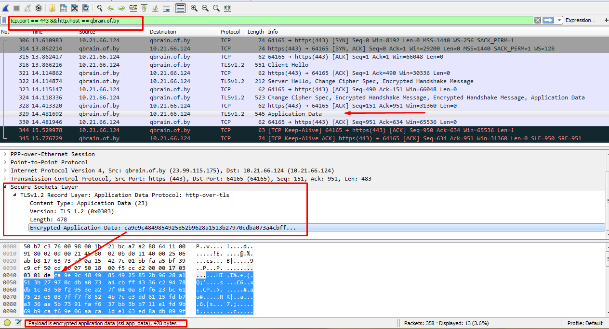

# Test cases

* Возможность пользователя управлять продвижением управляемых очередей
* Корректная обработок ошибок приложения (любая ошибка должна быть представлена соответствующим json-объектом, который клиент сможет обработать)
* Поддержка сервером защищенного протокола
* Наличие логирование результатов негативных тест-кейсов

## TC-01

### Описание

Возможность пользователя зарегестрироваться в приложении

### Сценарий

* Подготовить запрос:

  * POST `https://qbrain.of.by/api/registration?type=loginpass`

  * Тело:

    ```json
    {
      "name": "Mike",
      "email": "zzoxall@gmail.com",
      "password": "mikepassord"
    }
    ```

* Отправить запрос и проверить, что статус отвера 200 (OK)

* Открыть указанный при регистрации почтовый ящик и извлечь из ссылки регистрационный код (https://qbrain.of.by/regcomplete?reglink=rSraCBOkH1B09469BmmH)

* Отправить регистрационный код в приложение:

  * POST `https://qbrain.of.by/api/login?type=first`

  * Тело:

    ```json
    {
      "registrationLink": "rSraCBOkH1B09469BmmH"
    }
    ```

### Ожидаемый результат 

* Статус ответа 200 (OK)

* В теле ответа содержится sessionId:

  ```json
  {
    "sessionId": "6D3217B522313DFC4738D1124A6876D4"
  }
  ```

### Фактический результат 

Совпадает с ER

### Оценка

**TEST PASSED**


## TC-02

### Описание

Возможность пользователя аутентифицироваться в приложении

### Сценарий

* Подготовить запрос:

  * POST `https://qbrain.of.by/api/login?type=loginpass`

  * Тело:

    ```json
    {
      "email": "zzoxall@gmail.com",
      "password": "mikepassord"
    }
    ```

* Отправить запрос и проверить, что статус отвера 200 (OK)

### Ожидаемый результат

* Статус ответа 200 (OK)

* В теле ответа содержится sessionId:

  ```json
  {
    "sessionId": "6D3217B522313DFC4738D1124A6876D4"
  }
  ```

### Фактический результат

Совпадает с ER

### Оценка

**TEST PASSED**


## TC-03

### Описание

Невозможность неаутентифицированного пользователя работать с приложением

### Сценарий

* Отправить запрос:
  * GET `https://qbrain.of.by/api/queues/2`
* Проверить, что статус отвера 401 (OK)

### Ожидаемый результат

* Статус ответа 401 (Unauthorized)

* В теле ответа содержится сообщение об ошибке:

  ```json
  {
    "errorCode":"QB-B-003",
    "codeDescription":"Invalid credentials",
    "errorUUID":"43a7eb9b-9848-4ae8-9959-b86187c8d7c0",
    "errorMessage":"Forbidden access."
  }
  ```

### Фактический результат

Совпадает с ER, за исключением неправильного статуса ответа: 200 (OK)

### Оценка

**TEST PASSED WITH DEFECTS**


## TC-04

### Описание

Проверка логирование ошибок в приложении

## Требования

Перед прохождением теста необходимо воспроизвести негативный тест-кейс, например, TC-03.

### Сценарий

* Подключиться к удаленному серверу и перейти в папку с логами (`/home/zoxal/apache-tomcat-8.5.4/logs`)

### Ожидаемый результат

* В файле `/home/zoxal/apache-tomcat-8.5.4/logs/queuebrain_rest_errors_2018-01-18.log` содержатся данные наподобие

  ```log
  01:38:27.820 [http-nio-8375-exec-1] - UUID: 43a7eb9b-9848-4ae8-9959-b86187c8d7c0, code: QB-B-003, clientMessage: Forbidden access.
  com.zoxal.queuebrain.exceptions.QueueBrainException: Forbidden access
  	at com.zoxal.queuebrain.exceptions.ExceptionFactory.forbidden(ExceptionFactory.java:47)
  	at com.zoxal.queuebrain.security.handlers.QueueBrainAuthenticationEntryPoint.commence(QueueBrainAuthenticationEntryPoint.java:34)
  	at org.springframework.security.web.access.ExceptionTranslationFilter.sendStartAuthentication(ExceptionTranslationFilter.java:210)
  ```

### Фактический результат

Совпадает с ER

### Оценка

**TEST PASSED**


## TC-05

### Описание

Возможность пользователя создавать очереди 

### Требования

Пользователь должен быть ранее аутентифицирован

### Сценарий

* Подготовить запрос запрос:

  * POST `https://qbrain.of.by/api/queues`

  * Добавить заголовок `Cookie`: `JSESSIONID=<auth-session-id>`

  * Добавить тело:

    ```json
    {
      "name": "TestCaseQueue"
    }
    ```

* Отправить запрос и проверить, что статус отвера 200 (OK)

### Ожидаемый результат

* Статус ответа 200 (OK)

* В теле ответа содержатся данные о созданной очереди:

  ```json
  {
    "queueId": 13
  }
  ```

### Фактический результат

Совпадает с ER

### Оценка

**TEST PASSED**


## TC-06

### Описание

Возможность пользователя вступать в очереди

### Требования

Пользователь должен быть ранее аутентифицирован

### Сценарий

* Подготовить запрос запрос:
  * POST `https://qbrain.of.by/api/queues/2/enter`
  * Добавить заголовок `Cookie`: `JSESSIONID=<auth-session-id>`
* Отправить запрос и проверить, что статус отвера 200 (OK)

### Ожидаемый результат

* Статус ответа 200 (OK)

### Фактический результат

Совпадает с ER

### Оценка

**TEST PASSED**


## TC-07

### Описание

Возможность просматривать состояние используемых очередей

### Требования

Пользователь должен быть ранее аутентифицирован

### Сценарий

* Подготовить запрос запрос:
  * POST `https://qbrain.of.by/api/me`
  * Добавить заголовок `Cookie`: `JSESSIONID=<auth-session-id>`
* Отправить запрос и проверить, что статус отвера 200 (OK)

### Ожидаемый результат

* Статус ответа 200 (OK)

* В теле ответа содержатся данные:

  ```json
  {
    "id": 12,
    "name": "Mike",
    "usingQueues": [
      2
    ],
    "managedQueues": [
      13
    ]
  }
  ```

### Фактический результат

Ответ содержит лишнее поле "contacts":

```json
{
  "id": 12,
  "name": "Mike",
  "contacts": null,
  "usingQueues": [
    2
  ],
  "managedQueues": [
    13
  ]
}
```

### Оценка

**TEST PASSED WITH MINOR DEFECT**


## TC-08

### Описание

Невозможность продвинуть очередь, если новых пользователей нет

### Требования

* Пользователь должен быть ранее аутентифицирован
* Пользователь должен владеть очередью, обрабатывающей последнего пользователя

### Сценарий

* Подготовить запрос запрос:
  * PUT `https://qbrain.of.by/api/queues/13`
  * Добавить заголовок `Cookie`: `JSESSIONID=<auth-session-id>`
* Отправить запрос и проверить, что статус отвера 400 (Bad Request)

### Ожидаемый результат

* Статус ответа 400 (Bad Request)

* В теле ответа содержатся данные об ошибке:

  ```json
  {
    "errorCode": "QB-B-001",
    "codeDescription": "Request validation error",
    "errorUUID": "c33c422b-d165-4336-931d-fc2dfce429a7",
    "errorMessage": "Can not push queue: no more users."
  }
  ```

### Фактический результат

Совпадает с ER

### Оценка

**TEST PASSED**


## TC-09

### Описание

Проверка работы приложения по защищенному протоколу

### Сценарий

* Подготовить запрос запрос:
  * PUT `https://qbrain.of.by/api/users/me`
  * Добавить заголовок `Cookie`: `JSESSIONID=<auth-session-id>`
* Открыть и настроить программу wireshark для прослушивания сетевого трафика
* Отправить запрос

### Ожидаемый результат

* Трафик зашифрован и увидеть данные неовозможно

### Фактический результат

Совпадает с ER



### Оценка

**TEST PASSED**