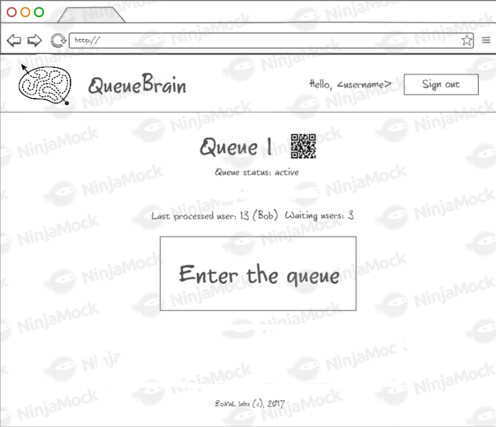

# QueueBrain
## Введение
Вы когда-нибудь стояли в очереди на прием в поликлиннике? А на заселение в общежитие или выселение из него? А когда-нибудь приходили в парикмахерскую и узнавали, что все парикмахеры на ближайшие 2 часа уже забронированы?..

Идея __QueueBrain__ -- упростить организационные проблемы, предоставив возможности удаленной регистрации в очереди и отслеживания её продвижения.

## Требования пользователя
### Программные интерфейсы
* Авторизация пользователей должена быть возможена через следующие сервисы:
    - ВК
    - Facebook
    - Google
    - GitHub
* Должно быть реализовано REST и SOAP API, позволяющее полноценно работать с приложением, в том числе от лица администратора. 
### Интерфейс пользователя
* Главный экран приложения
    
* Кабинет пользователя
    
* Страница с очередью
    
### Характеристики пользователей
QueueBrain хорошо подойдет для огранизации нерегулярных очередей с несложными процессами обработки. Интерфейс и идея программы достаточно просты и привычны для среднего Интернет-пользоватлея.
## Системные требования:
#### Управление пользователями    
* Зарегестрированные пользователи должны иметь возможность:
    - Вставать в очереди
    - Выходить из очереди
    - Создавать очереди и управлять ими
    - Оставлять комментарии к очереди
* Незарегестрированные пользователи также должны иметь возможность встать в очередь, если это разрешено администратором. 
* Пользователи должны иметь возможность оставить в приложении данные для связи.
* Пользователь должен иметь возможность управлять оповещаниями от приложения.

#### Управление очередями
* Доступ к управлению очередью должен иметь только администратор. 
* При создании очереди должны быть доступны следующие настройки:
    - Доступность очереди незарегестрированным пользователям
    - Лимит на участников очереди
* Администратор должен иметь возможность управлять продвижением очереди:
    - Перейти к следующему пользователю
    - Изменить состояние очереди (не начата/активна/пауза/завершена)
* На иформационной странице очереди должна быть доступна информация:
    - Состояние очереди (не начата/активна/пауза/завершена)
    - Среднее время обработки
    - QR-код ссылки на очередь
    - Последний обработанный пользователь и количество ожидающих пользователей

#### Использование очереди
* При регистрации в очереди пользователь должен получить свой уникальный код. 
* Администратору при обработке пользователя должен быть доступен его уникальный код.

### Нефункциональные требования
* Приложение должно работать по защищенному протоколу.
* Приложение должно быть интернационализованным (поддержка как минимум русского и английского языков).

## Аналоги
Основное отличие от большинства аналогов -- способ предоставления сервиса. QueueBrain является веб-приложением, это значительно упрощает процесс использования, а публичное API позволяет легко интегрировать его с другими системами. 
Все перечисленные аналоги требуют предварительной установки и настройки.
* https://led-displays.ru/programma_suo.html
    - Платная
    - Сервер очереди должен находиться локальной сети
    - Windows only
* http://www.kkc.by/katalog/spec-sistemy/sistema-upravleniya-ocheredyu
    - Платная
* http://apertum.com.ua/
    - Сервер очереди должен находиться локальной сети